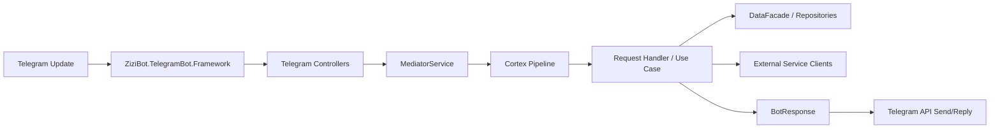
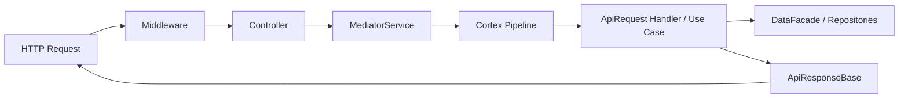

# Architecture

## High-Level Overview

ZiziBot-Engine is a multi-host .NET 8 backend centered around a Telegram bot engine, with a REST API and background job scheduling. A separate TypeScript monorepo provides web/console UIs and shared client packages.

## Primary Runtime Processes

### 1) Backend Host: ZiziBot.Engine (ASP.NET Core)

Entrypoint: [Program.cs](../../backend/ZiziBot.Engine/Program.cs#L1-L35)

Boot sequence (in order):

1. Configuration load (dotenv + Mongo-backed config + optional local JSON overrides)
   - [LoadSettings](../../backend/ZiziBot.Application/Extensions/ConfigurationExtension.cs#L15-L22)
2. Host listen port configuration (custom extension)
3. Dependency injection composition and cross-cutting wiring
   - [ConfigureServices](../../backend/ZiziBot.Application/Extensions/ServiceExtension.cs#L23-L36)
4. Telegram bot framework integration and bot token discovery from database
   - [ConfigureTelegramBot](../../backend/ZiziBot.Presentation/Bots/Telegram/TelegramExtension.cs#L16-L37)
5. Logging, scheduler, REST API, middleware
   - REST API wiring: [RestApiExtension](../../backend/ZiziBot.Presentation/Extensions/RestApiExtension.cs#L21-L193)
6. Application startup: print about, migrations, start scheduler, start Telegram bot engine, start web host
   - Mongo migrations: [UseMongoMigration](../../backend/ZiziBot.Engine/Program.cs#L25-L27)
   - Telegram runtime: [RunTelegramBot](../../backend/ZiziBot.Presentation/Bots/Telegram/TelegramExtension.cs#L39-L76)

### 2) Frontend (Turborepo / Next.js)

Monorepo root: [frontend/turborepo-zizibot-console](../../frontend/turborepo-zizibot-console)

Contains multiple Next.js apps (console/web/docs) plus shared TypeScript packages (UI, REST client, contracts).

## Core Architectural Patterns

### Layering (Backend)

- **Host layer**: ZiziBot.Engine composes everything and runs processes.
- **Application layer**: requests/handlers/use-cases; Cortex mediator pipeline + behaviors.
- **Delivery layers**
  - Telegram controllers (update → request)
  - REST controllers (HTTP → request)
- **Infrastructure layer**: cross-cutting wiring (configuration, logging, HTTP client defaults).
- **Database layer**: MongoDB context, repositories, migrations, caching layers.
- **Common**: shared contracts, DTOs, config models, constants, enums, utilities (integrated directly into the application layer under ZiziBot.Application/Common).

### Request/Handler Model (Cortex Mediator)

Most “business actions” are modeled as requests handled through `IAppMediator`, which is backed by Cortex.Mediator. The pipeline enforces cross-cutting rules (logging, feature flags, role/restriction checks, anti-spam, etc.) before the actual handler is executed, and a dedicated post-process stage runs Telegram side effects after the handler returns.

Pipeline registration: [CortexExtension](../../backend/ZiziBot.Application/Extensions/CortexExtension.cs#L7-L35)

### Execution Strategies (Sync vs Background)

Requests can be executed immediately or scheduled/enqueued (Hangfire or an in-process background queue).

Dispatcher: [MediatorService](../../backend/ZiziBot.Application/Services/MediatorService.cs#L17-L86)

## Runtime Data Flow

### Telegram Update Flow

### REST API Flow

## Configuration Sources (Backend)

Configuration is assembled from multiple sources:

- Environment variables and `.env` via dotenv: [LoadSettings](../../backend/ZiziBot.Application/Extensions/ConfigurationExtension.cs#L15-L22)
- Mongo-backed configuration provider (requires `MONGODB_CONNECTION_STRING` and database name): [AddMongoConfigurationSource](../../backend/ZiziBot.Application/Extensions/ConfigurationExtension.cs#L84-L97)
- Optional local JSON overrides loaded from `Storage/AppSettings/Current/*.json`: [LoadLocalSettings](../../backend/ZiziBot.Application/Extensions/ConfigurationExtension.cs#L44-L60)
