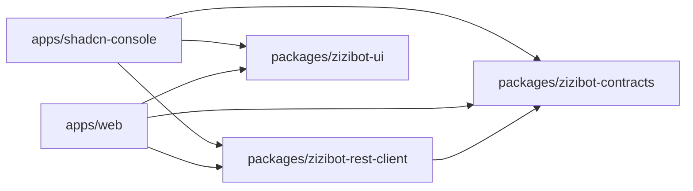

# Dependencies

## Backend Project References (Solution Graph)

The main host project references the core layers and delivery modules:

- Host: [ZiziBot.Engine.csproj](../../backend/ZiziBot.Engine/ZiziBot.Engine.csproj)
  - Application layer: `ZiziBot.Application`
  - Persistence: `ZiziBot.Database`
  - Delivery: `ZiziBot.Presentation` (Web API + Telegram + Discord)
  - Scheduling: `ZiziBot.Scheduler` (namespace lives inside Application)
  - Cross-cutting: `ZiziBot.Infrastructure` (namespace lives inside Application), `ZiziBot.Common` (includes former Attributes)

```mermaid
flowchart TB
  Engine[ZiziBot.Engine] --> App[ZiziBot.Application]
  Engine --> Pres[ZiziBot.Presentation]
  Engine --> Db[ZiziBot.Database]
  Pres --> App
  Pres --> Db
  App --> Db
  Db --> Common[ZiziBot.Common]
  App --> TgFramework[ZiziBot.TelegramBot.Framework (vendored)]
```

## External Infrastructure Dependencies

### MongoDB (Required)

- Used as the primary database via a MongoDB EF Core provider.
- Required env var: `MONGODB_CONNECTION_STRING`
  - Must include a database name, otherwise configuration load throws:
    - [AddMongoConfigurationSource](../../backend/ZiziBot.Application/Extensions/ConfigurationExtension.cs#L84-L97)
- Dev docker compose provides Mongo on port 27017:
  - [docker-dev.yaml](../../docker-dev.yaml#L13-L20)

### Hangfire (Job Scheduling)

- Used for background jobs and delayed execution via `ExecutionStrategy.Hangfire`.
- Dispatcher bridges requests into Hangfire jobs:
  - [MediatorService.EnqueueAsync](../../backend/ZiziBot.Application/Services/MediatorService.cs#L17-L40)
- Hangfire config model:
  - [HangfireConfig](../../backend/ZiziBot.Common/Configs/HangfireConfig.cs)

### Background Queue (In-Process)

- Used for lightweight background execution when `ExecutionStrategy.Background` is chosen.
- Configured via:
  - [ServiceExtension.ConfigureBackgroundQueue](../../backend/ZiziBot.Application/Extensions/ServiceExtension.cs#L109-L114)

### Cache Providers (Optional / Config-Driven)

- CacheTower provides layered cache options:
  - In-memory (default)
  - Redis (when enabled)
  - MongoDB/Sqlite/Json/Firebase layers (when enabled)
  - Wiring entrypoint: [CacheTowerExtension](../../backend/ZiziBot.Application/Database/Extensions/CacheTowerExtension.cs)

## External Service Integrations (Outbound HTTP)

Outbound HTTP calls are centered around Flurl, with globally configured defaults/logging:

- [ServiceExtension.ConfigureFlurl](../../backend/ZiziBot.Application/Extensions/ServiceExtension.cs#L38-L72)

Service wrappers live under:

- [ZiziBot.Application/Services](../../backend/ZiziBot.Application/Services)

Representative integrations include:

- Telegram API: via `Telegram.Bot` and the internal framework (delivery layer).
- Anti-spam: CAS + SpamWatch (see [AntiSpamService](../../backend/ZiziBot.Application/Services/AntiSpamService.cs)).
- OCR providers: Optiic.dev and OCR.Space (see [OptiicDevService](../../backend/ZiziBot.Application/Services/OptiicDevService.cs), [OcrSpaceRestService](../../backend/ZiziBot.Application/Services/OcrSpaceRestService.cs)).
- Shipment tracking: BinderByte + Tonjoo (see [BinderByteService](../../backend/ZiziBot.Application/Services/BinderByteService.cs), [TonjooService](../../backend/ZiziBot.Application/Services/TonjooService.cs)).
- GitHub webhooks parsing: Octokit.Webhooks (see [WebhookService](../../backend/ZiziBot.Application/Services/WebhookService.cs)).

## Frontend Workspace Dependencies

- Workspace definition: [pnpm-workspace.yaml](../../frontend/turborepo-zizibot-console/pnpm-workspace.yaml#L1-L4)
- Root scripts and engines (Node >= 20): [package.json](../../frontend/turborepo-zizibot-console/package.json#L1-L33)
- Typical internal dependency flow:


